# Education Institution Data Analysis
## What is the socioeconomic status of an average student in US colleges?

## Introduction

The goal of this data analysis project is to compare and analyze public and private colleges in the United States. By exploring factors such as enrollment, tuition fees, graduation rates, student-faculty ratios, and financial aid availability, we aim to gain insights into the similarities and differences between these two types of institutions. This analysis will provide a comprehensive understanding of the educational landscape, empowering individuals to make informed decisions when considering college choices.

*Analysis of Public /Private colleges in USA*

* Ethnicity and Gender distribuion

* Popular field of study

* Similarities and Differences between Public/ Private

* Hypothesis testing on our findings

## Data

The dataset comprises institution-level data files from 1996-97 through 2020-21, encompassing a comprehensive range of information on institutional characteristics, enrollment, student aid, costs, and student outcomes. To ensure the accuracy and relevance of the analysis, we focused on the most recent data available.

During the data analysis process, we applied a filter to include only columns with null percentages lower than 30%. From this refined list, we carefully selected the columns for further analysis.

*    "id" (UNITID): Institutional identification number.
*    "name" (INSTNM): Name of the institution.
*    "city" (CITY): City where the institution is located.
*    "state" (STABBR): State where the institution is located.
*    "zipcode" (ZIP): Zip code of the institution's location.
*    "main_campus" (MAIN): Flag indicating if the institution is the main campus (1: main campus, 0: not the main campus).
*    "highest_degree" (HIGHDEG): Highest degree awarded by the institution (0: Non-degree-granting, 1: Certificate degree, 2: Associate degree, 3: Bachelor's degree, 4: Graduate degree).
*    "lat" (LATITUDE): Latitude coordinate of the institution's location.
*    "lng" (LONGITUDE): Longitude coordinate of the institution's location.
*    "control" (CONTROL): Control of the institution (public, private nonprofit, or private for-profit).
*    "openadmp" (OPENADMP): Flag indicating if the institution has open admission policy (1: yes, 0: no).
*    "historicalblack_college" (HBCU): Flag indicating if the institution is a historically black college or university (HBCU).
$$\vdots$$
*    "percentage_of_agriculture_major" (PCIP01): Percentage of students majoring in agriculture-related fields.
$$\vdots$$
*    "student_count" (UGDS): Total student count at the institution.
*    "enrollment_proportion_white" (UGDS_WHITE): Proportion of enrolled students who are white.
$$\vdots$$
*    "cost_of_admission" (COSTT4_A): Cost of admission for the institution (average).
*    "cost_of_admission_p" (COSTT4_P): Cost of admission for the institution (program-specific).
*    "tuition" (TUITFTE): Average instructional expenditure per full-time equivalent student.
*    "instructional_expenditure" (INEXPFTE): Average instructional expenditure per full-time equivalent student.
*    "percentage_of_pellgrant" (PCTPELL): Percentage of undergraduate students receiving Pell grants.
*    "percentage_of_federalloan" (PCTFLOAN): Percentage of undergraduate students receiving federal student loans.
*    "percentage_of_over25" (UG25ABV): Percentage of undergraduate students over 25 years old.
*    "enrollment_percentage_man" (UGDS_MEN): Percentage of enrolled students who are male.
*    "enrollment_percentage_women" (UGDS_WOMEN): Percentage of enrolled students who are female.
*    "public/private" (SCHTYPE): Indicates if the institution is public or private.
*    "faculity_ratio_student" (STUFACR): Faculty-to-student ratio.
$$\vdots$$

## Methodology

* Data Collection:

    * Gathered data from reputable sources, including official college websites, government databases, and educational research institutes.
    * Collected information on key factors such as enrollment numbers, tuition fees, graduation rates, student-faculty ratios, and financial aid offerings.
    * Ensured data consistency and accuracy through thorough validation and cross-referencing.

* Data Preparation and Cleaning:

    * Performed data cleaning tasks such as handling missing values, removing duplicates, and standardizing data formats.
    * Conducted data normalization or scaling to ensure fair comparisons between public and private colleges.
    * Addressed outliers or inconsistent data points appropriately, ensuring they did not skew the analysis.

* Exploratory Data Analysis (EDA):

    * Conducted descriptive statistics and visualizations to gain initial insights into the dataset.
    * Explored the distribution and spread of various factors across public and private colleges.
    * Examined correlations between different variables to identify potential relationships.

* Comparative Analysis:

    * Compared enrollment figures to assess the size differences between public and private colleges.
    * Analyzed tuition fees to evaluate the affordability aspect of public and private institutions.
    * Investigated graduation rates to determine the success rates of students in both types of colleges.
    * Explored student-faculty ratios to understand the level of individual attention provided by each institution.
    * Assessed the availability and types of financial aid offered by public and private colleges.

* Statistical Testing:

    * Conducted statistical tests, such as t-tests or chi-square tests, to determine if there are significant differences between public and private colleges in various factors.
    * Utilized appropriate hypothesis testing methods to evaluate the significance of observed differences.

## Visualization

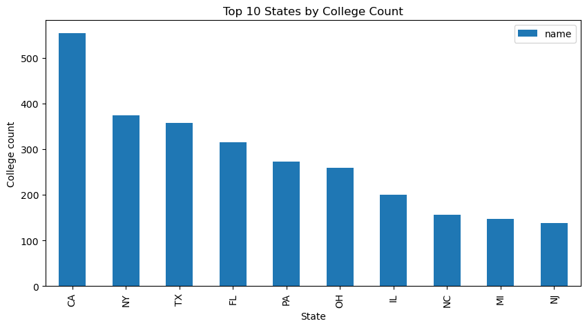
This shows the top 15 states with collegees in them using a bar chart. 
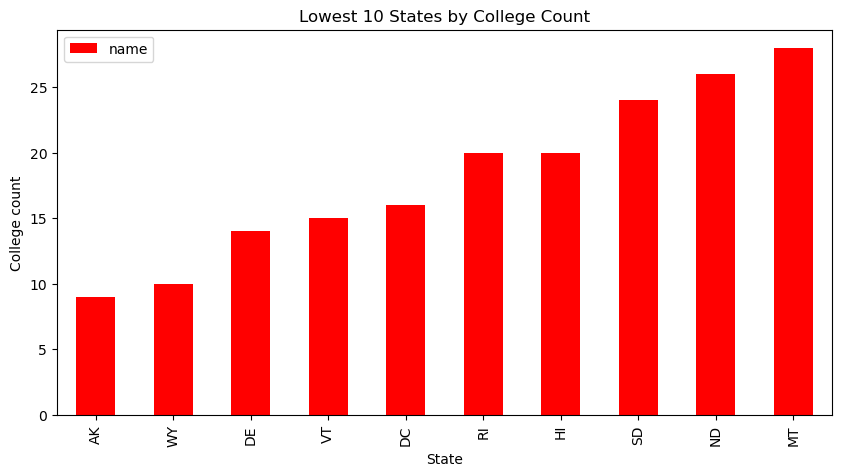

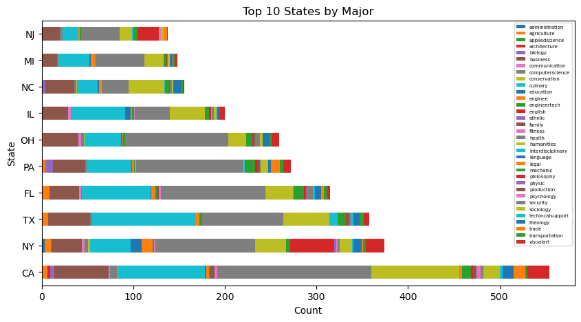

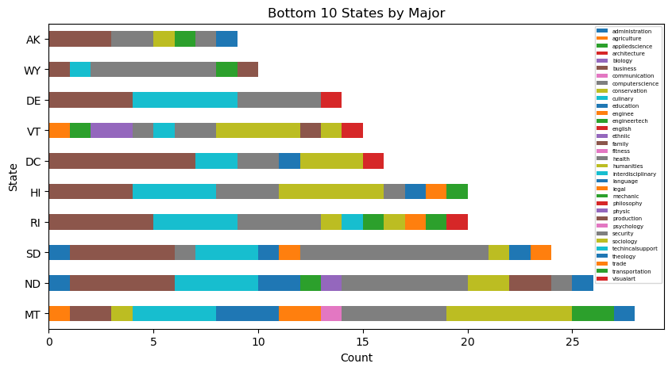

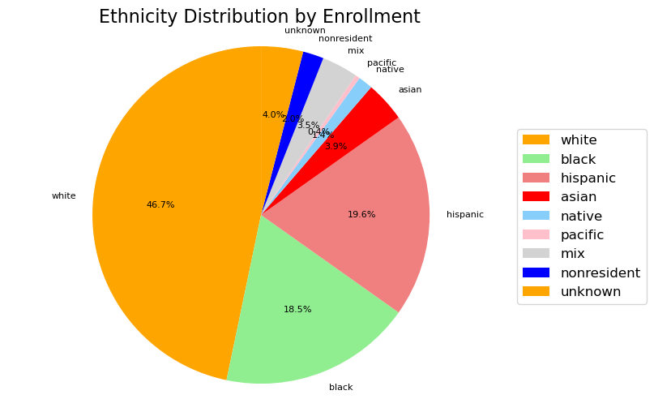

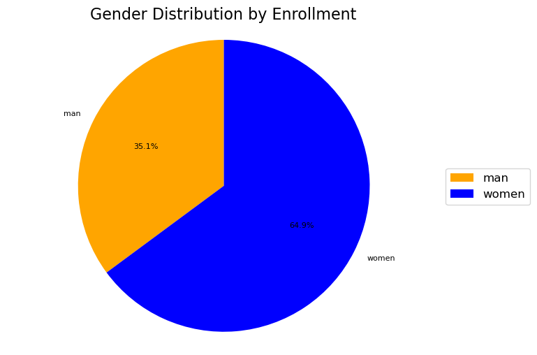

## Analysis

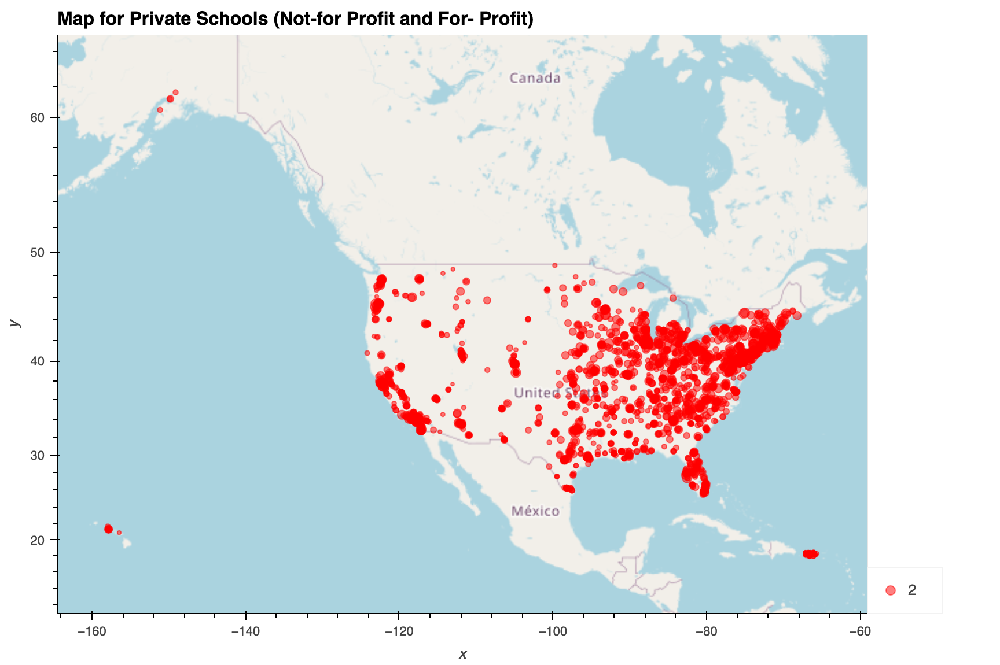

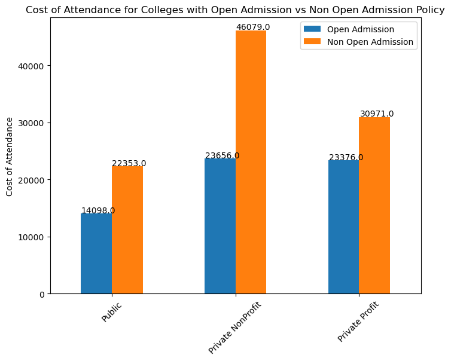

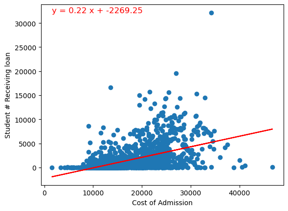

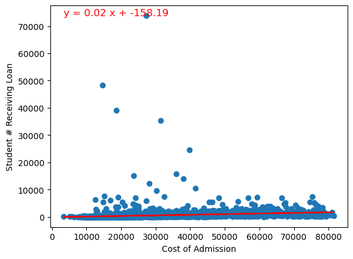

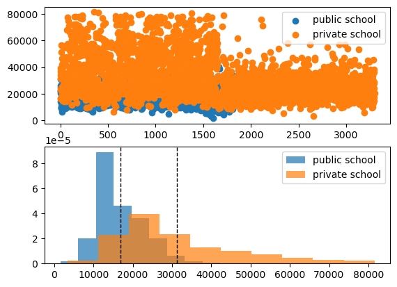

## Conclusion

In our analysis comparing public and private colleges in the United States, we examined factors such as enrollment, tuition fees, graduation rates, student-faculty ratios, and financial aid availability. Specifically, we focused on the relationship between the number of students receiving federal loans and the admission cost, separately for public and private institutions. We found that public colleges demonstrated a strong and significant linear relationship between the number of loan recipients and the admission cost. This suggests that as the number of students receiving federal loans increased, the admission cost tended to follow a predictable pattern. However, in the case of private colleges, the relationship between the number of loan recipients and the admission cost was weaker, indicating that other factors play a more dominant role in determining the cost of admission for private institutions.

To further investigate the difference in admission costs between public and private schools, we conducted an independent t-test. The results of the t-test provided strong evidence against the null hypothesis, indicating a significant difference in the admission costs between the two types of institutions. This suggests that public and private colleges in the United States have distinct cost structures. Prospective students should take this into account when considering college choices and carefully evaluate their financial situation, academic goals, and the overall value provided by public and private colleges. By considering factors such as enrollment, tuition fees, graduation rates, student-faculty ratios, and financial aid availability, individuals can make informed decisions that align with their needs and aspirations, ensuring a fulfilling and successful college experience.

## Contributors

* Beenish MM : 
* Christopher Heng : 
* JongWook Choe : 
* Michael Bernstein : 
* Vidhya Lakshmi : 

